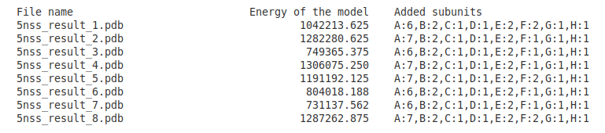
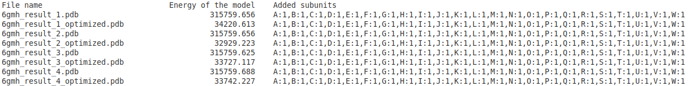
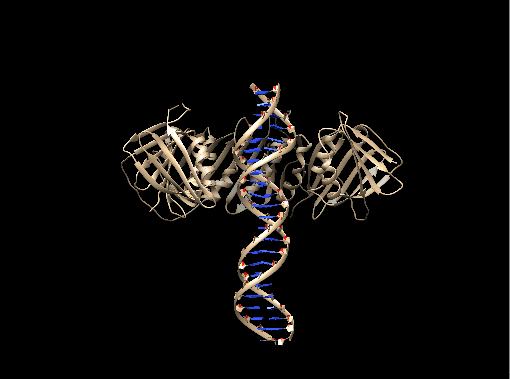

### Authors
Alejandro Peralta García, David Sotillo Núñez and Adrià Pont Beltrán

### GitHub
[Link to the GitHub repository](https://github.com/DSotillo/PrediProt)

# Introduction

**PrediProt** is a tool for assembling multiple protein complexes (with also DNA/RNA molecules) by **superimposing pairs of interacting molecules**. These pairs of molecules are submitted in PDB format and, with the aid of a FASTA file of the complex we want to obtain, they are joined by superimposing identical chains until the complex is built, which is then written in PDB format.

# Algorithm

1. The **FASTA file** is read and the subunits wich are identical are counted as the same protein for stoichiometry purposes.

2. The **PDB files** are read. Each chain of each PDB is **aligned** with the sequences in the FASTA file and, if they match (they should), they are stored and also the PDB as a whole, which we call _structure_.

3. **Pairwise alignments** between the chains of every structure are performed. If two chains align they could possibly be the same subunit in the final complex, so the other subunits they are attached to would be linked by this common subunit. For example, if we have structure 1 with chains F and J (arbitrary names) and structure 2 with chains R and S, and chains F and S align, then both structures could be joined by superimposing R and S and making a complex of J-X-R, being X the subunit R/S (name is arbitrary; they are the same). After every alignment is done, **interactions between structures are stored** in a list.

4. Starting from the most interacting structure, **subunits are randomly added** by superimposition, checking if the newly added subunit **does not clash** with any other already existing subunit. Superimposition details are explained after algorithm steps.

5. **Added chains ID are changed** to ignore original chains ID and start from letter A. This is done because the original structures chains ID will all probably be "A" and "B", and in order not to repeat letters we assign them new IDs.

6. After every subunit is added (either because no more subunits fit in the model without clashing or because the desired stoichiometry is reached) **the algorithm stops adding subunits**.

7. **The energy of the model is calculated by Modelle**r and, if the user specifies it, an **optimized version** of the model will be created by the same software. The energy does not have any units, it is the **negative log of the molecular probability density function**.

8. A different **PDB file is obtained** for each model created and also, if the user chose to optimize the models, an optimized PDB for each model is also obtained. A **log file** is finally created containing the energy of each model generated, the stoichiometry of the model and also various parameters such as the seed used (for replicability).

## Superimposition

After finding an interaction to be added to the complex the superiposition starts. First, atoms to be superimposed must be prepared. For doing this, the program selects the residues that aligned between the chains that are going to be superimposed and it extracts the **coordinates of the alpha-carbon (or phosphorus in DNA/RNA) atoms**. The aligning chain of the to-be-added structure is superimposed over the complex chain, obtaining a **rotation matrix** as result. Next, the new subunit that will be added to the complex (not the one aligning, as that subunit is already in the complex) is incorporated into the complex by applying the rotation matrix.

After the incorporation, **clashes between the new chain and the other ones are calculated**. If the alpha-carbon atoms are too close, a clash is considered. For small subunits a single atom-atom clash could be enough to consider that the subunits occupy the same three dimensional space, but for larger subunits the margin should be more flexible. We established **5 atom-atom clashes** as a good limit obtained empirically. If more than 5 clashes are found, superimposition is aborted as it is considered that the added subunit occupies the same space as an existing subunit. If not, superimposition is finished and the algorithm continues with the next interaction.

# Prerequisites
* __Python__ version __3.6__ or higher
* __Python__ modules / packages (Most already included in basic Python 3 libraries):
    * sys
    * os
    * argparse
    * random
    * copy
    * re

* [Modeller (Optional but necessary for final optimization and energy of the model)](https://salilab.org/modeller/ "About Modeller")
* Tkinter for Python 3.6 (see __Installation__)

# Installation
We provide two separate options of installation depending on which OS will be running and / or user preference. However, keep in mind that at least __Python 3.6__ is required.

__IMPORTANT WARNING__: There is an issue with a default Bio.PDB function. The object Atom does not inherit a given attribute when a copy is made through _.copy()_. When running PrediProt with some models an error with the Bio.PDB module may arise. The solution consists on the following:
Go to the python libraries directory (/home/user/.local/lib/python3.6/site-packages/Bio/PDB) and edit the __Atom .py__ file. Inside the '__class DisorderedAtom(DisorderedEntityWrapper)__' the following function must be added:

```
def copy(self):
      shallow = copy.copy(self)
      for child in self.child_dict.values():
          shallow.disordered_add(child.copy())
      return shallow
```

### Method 1: pip
This method will allow the user to install PrediProt without downloading any file directly and the needed dependencies will also be directly downloaded by running the following on the command line:

```
sudo pip3 install PrediProt
```
Just like that the latest version of PrediProt available in PyPi will be installed. However, for the _GUI_ version of the program the __tkinter__ module is needed and cannot be installed by pip. As since Python 3 this module comes installed within the basic dependencies it should be already installed. But if that is not the case the following command will install tkinter for Python 3.
```
sudo apt-get install python3-tk
```

In order to uninstall PrediProt if installed by this method, just the following is needed:
```
sudo pip3 uninstall PrediProt
```
### Method 2: deb package
On PrediProt's github repository the __.deb__ package corresponding to the latest version of the program can be found. For any debian's distribution user this option may be simpler, as no extra dependencies will be downloaded. However, the user must keep in mind that __Python 3.6__ is still required even though the installation can be performed without errors. The main difference with the pip method is that the _GUI_ version in the __.deb__ package is already compiled (through __pyinstaller__) as a standalone executable and therefore is directly installed in the __/usr/share/applications__ folder and can be accessed from the installed applications menu. This is also an advantage, as any dependency that is used by the _GUI_ is already included in the standalone file. In order to install the package any package manager can be used or, alternatively, this command can be run from the folder where the downloaded file is:

```
sudo dpkg -i prediprot_X.X.X_all.deb
```
Where Xs correspond to the downloaded version.
In order to uninstall the PrediProt __.deb__ package any manager can do the trick or, again, this can be run (this time from anywhere):
```
sudo apt remove prediprot
```

# Command-line arguments:
## Mandatory arguments:
-p --inputpdb: directory that contains the PDB files that are used to build the complex. The program will enter on that directory and will read only the files with the ".pdb" extension. Each of these files must contain only two interacting chains of the original complex.

-f --inputfasta: fasta file containing the sequences of the original complex. The program uses this file to obtain the unique subunits of the complex. Then the sequences obtained from every PDB are aligned to the unique subunits of the given fasta, in order to identify each chain of each PDB as a subunit of the complex.

***WARNING: sometimes the sequences of the chains in the PDBs and the sequences of the fasta files obtained directly from rcsb.org do not coincide. Then the program raises an exception explaining which chains of the PDBs do not align with the subunits given by the fasta that the user has selected. Every one of the chains must align with one of the unique subunits, if it does not happen, maybe the fasta used is not correct. If the user thinks that the fasta is the correct one, then the sequences from the PDBs and the fasta are quite different. Here there are provided two solutions:***

***-The threshold of that alignment is 0.95 by default, but it can be lowered manually in the read_and_store_pdbs function of the program.***

***-It is included a script called PrediProt_getfasta, where the user must give the original PDB file of the complex, and the fasta is created from the sequences of the chains of this PDB. The fasta files of the examples are obtained this way.***

## Optional arguments:
-o --output: name of the directory where the output files are stored. If the path is not specified using the -od (output_path) argument, it is created where the program is running. If there is already a directory with that name on the selected path, the output files are added there. The stored output files are the log file and a number of final models with pdb format. Every one of them are named with the output name that the user provides. If the user does not provide an output name, then a directory named as the prefix of the given fasta file plus '\_result' is created. For example: 5nss_result when the fasta file is 5nss.fa.

-od --output_path: path where the output directory is created. If not specified, it is created where the program is running.

-stoinfo --stoichiometry_info: it creates a fasta with the unique subunits where the program is running. The program reads the fasta provided by the user, and it selects the unique sequences: two chains with a sequence identity higher than 0.95 are considered as the same subunit of the complex. Then it creates a fasta with this unique subunits, with new IDs, and the information of the expected stoichiometry of the complex appears on the terminal. This information is obtained from the input fasta, so it will give the user an idea of the original stoichiometry of the complex, but only when the fasta provided contains all the chains of the complex. Then the user can select an specific stoichiometry for the model(s), with this format: A:3,B:3,D:1,C:1, where each letter represents the ID of the subunit that can be seen at the fasta that contains the subunits, and each number is the maximum number of times that each subunit is going to appear in the final model(s).

-sto --stoichiometry: here the user can directly select a specific stoichiometry for the model, without creating the fasta with the unique subunits. The format must be like this: A:3,B:3,D:1,C:1, where each letter represents the ID of the subunit that can be seen at the fasta that contains the subunits, and each number is the maximum number of times that each subunit is going to appear in the final model(s).

-m --models: number of models that are created. By default, only one model is created. In the log file it can be found the energy of each model and the subunits that have been added. Depending on the complex, the models may not be equal, because they can be builded differently, since the order of the added chains may change depending on the selected seed (see the info below).

-r --random: if selected, the initial structure to build the complex is chosen randomly. If not, the initial structure is always the one that has more interactions with the other structures.

-s --seed: it is used to replicate an experiment. It can be any combination of characters. Each seed determines a unique way to build a model, because the chains are added in a certain order. The seed that has been used is saved in the log file, so if it is used again, the structures will be builded the same way, and other parameters like a specific stoichiometry or the optimization can be selected. If no specific seed is selected, then the model(s) constructed can not be replicated.

-z --optimize: if selected, modeller is used to optimize each of the results, so it is created also an optimized PDB. In the log file the energy is of those optimized models is also saved. If modeller is not installed properly, this argument does not work.

-c --clash_distance:  if used, this float (between 0.1\AA and 1.0\AA) defines the distance cutt-off at which an interaction will be considered a clash. Atomic interactions with distances below this threshold will not be considered when building the model. The default distance cut-off when this argument is not specified is 0.5\AA.

# Graphical User Interface version
With this software we also provide a _Graphical User Interface_ (_GUI_, from now on) for the sake of the comfort when introducing the inputs, as the with the normal console version the user might end up with long and convoluted commands as three paths can be entered as inputs and many options are available.
The function the _GUI_ performs is to serve as a simple bridge between the user and the final arguments that will be sent to the main PrediProt script. Because the final outcome of the GUI script is running the original PrediProt, the resulting model(s) will not change when running PrediProt either directly through the command line or through the _GUI_.
In order to run the GUI version of PrediProt, enter "__PrediProt_GUI__" in the command line. The following window should appear:

<p align="center">
    </p>


The elements in the window are linked to the previously explained arguments in order to make inputs simpler.
For the sake of avoiding errors and losses of time running the script to a certain point where it will crash and produce an error, some parameters are limited in different ways, such as in range (Clash distance) or in availability (Text box for stoichiometry). For the same reason, the _GUI_ is designed in a way which the "_Run Program_" button will be disabled until the required arguments (FASTA file and PDB directory) are introduced, and therefore only those are required.
The rest of the elements are set to the default values, and only introducing the two required inputs and clicking "_Run Program_" is equivalent to introducing only those two arguments in the command line.
The three inputs that require paths (The 2 mandatory ones and the optional one) produce relative paths to where the _GUI_ is run in order to escape the sometimes excessive length of absolute paths and improve the visibility so the user can ensure their input is the desired one.

___IMPORTANT: When in the 'selecting a directory' dialog window, the user MUST be inside the desired folder, as only selecting it and clicking 'Ok' will cause to enter as input the current folder the dialog is in.___

With the _GUI_ it is also provided the option of saving and loading the current settings for the sake of replicability and in order to keep track of inputs if running the script multiple times with similar parameters, and serves as a complement of the __.log__ file.
The user can choose the name and localization where the parameters file will be saved. The extension this file has is __.prediprot__, and is introduced automatically when saving, so the user only has to enter its name.
Additionally, the default parameters can be restored via the "_Reset parameters_" button.
As a quick reminder to consult when using the _GUI_, a "_Help_" button is provided which will open an additional window with a short description for every input.

___NOTE: As in the command line version, the INFO option in the stoichiometry input will generate the FASTA file and will ask for input in the terminal, so make sure to be aware of the terminal when running the GUI with this option selected!___

# Examples

All this examples can be reproduced with the provided files in the examples directory. There the user can find the input files and results stored in the directories named after the complex ID. On every directory the user can find the fasta file of the complex, a directory named 'complex_ID_pairs' that contains the PDBs of the paired interacting chains, and also the directory with the results.

___NOTE: The replication can be performed within the same computer. Results differ between computers.___

Important: all the fastas have been obtained directly from the original pdb file of each complex using the included function PrediProt_getfasta. For example, for the 5NSS complex, the fasta is obtained this way:
```
PrediProt_getfasta -i 5nss.pdb -p 5nss
```
Where -i is the input pdb file and -p is the prefix of the fasta file: here 5nss.fa is obtained.

The following codes are expected to be used when the program runs in the examples directory. Remember to use the output argument -od to specify where to create the directory, and -o to specify the name of the output directory and files.

## 5NSS
5NSS is a RNA polymerase that includes the promoter DNA and a transcription activator.

This is a complex that includes DNA-protein interactions and has repeated chains, so it is ideal to show the multiple optional arguments of PrediProt.

First of all, here it is a basic usage of PrediProt with one output model. It is advisable to use a specific seed with -s in order to replicate the result later:
```
PrediProt -p 5nss/5nss_pairs -f 5nss/5nss.fa -s seed1
```
The output arguments -o and -od have not been specified, so the directory 5nss_results is created where the program is running.

| | |
| :---: | :---: |
| *Original* | *Non-optimized model* |

The model builded is clearly incorrect. Then the user can use the -m argument in order to do multiple models, because each one will be built differently. Now let's build 8 models:

```
PrediProt -p 5nss/5nss_pairs -f 5nss/5nss.fa -s seed1 -m 8
```
The log file named 5nss_results_log.txt includes the energy of every model and the added chains, in the following format:



Notice that the first model, 5nss_result_1.pdb, is the previous incorrect one, replicated here because the same seed has been used.
The model with the lowest energy should be the best, but notice that in some models the added subunits are different, because they have been builded differently.
We can use -stoinfo to see which is the expected stoichiometry from the given fasta: A:6,B:2,C:1,D:1,E:1,F:1,G:1,H:1

So, if we select this specific stoichiometry the models will have only the expected subunits. This can be specified after using -stoinfo or using -sto like this:
```
PrediProt -p 5nss/5nss_pairs -f 5nss/5nss.fa -m 8 -s seed1 -sto A:6,B:2,C:1,D:1,E:1,F:1,G:1,H:1
```
Then the log file has changed:


It seems the file 5nss_result_7.pdb is the most fitting one, because it has the lowest energy and all the expected subunits have been added.

Here it is explained another usage of the specific stoichiometry. For example, if the user only wants to get the two DNA strands of this complex.
Using the -stoinfo argument the program creates a fasta file with the subunits of the complex and the new IDs of them. Looking at it, the user can identify those subunits: the DNA chains are the ones with F and H IDs. With the following command line:
```
PrediProt -p 5nss/5nss_pairs -f 5nss/5nss.fa -sto F:1,H:1
```
The constructed model only contains the two selected subunits, which are the two DNA chains:


| |  |
| :---: | :---: |
| *Original* | *Specific stoichiometry* |

Other argument is the random initial structure (-r). When it is selected, the initial structure of each model will be random. Again, the seed is important here because it allows the user to replicate a experiment:
```
PrediProt -p 5nss/5nss_pairs -f 5nss/5nss.fa -m 8 -s seed1 -r
```
Notice that the seed is the same as in the previous examples (seed1), but the models are different. This is due to the use of -r. To replicate this result, it is needed to use again that seed and -r. Here it is the new log text:


In this case, the results do not seem better than before, but the user may use -r if the models constructed without it are not good enough.

The results can also be optimized adding -z to the command line:
```
PrediProt -p 5nss/5nss_pairs -f 5nss/5nss.fa -m 8 -s seed1 -sto A:6,B:2,C:1,D:1,E:1,F:1,G:1,H:1 -z
```
The file 5nss_result_7_optimized is obtained, and here it is compared to the original complex and the non-optimized model:


|  |  |  |
| :---: | :---: | :---: |
| *Original* | *Non-optimized model* | *Optimized model*|

The model is quite good, but is not perfect. The subunit A, which is repeated 6 times, is not properly constructed, but the rest of the complex is pretty accurate.

## 6GMH
It is an activated transcription complex, and it includes RNA-protein interactions.
In this complex all the chains are unique. When doing several models, all of them will have the same structure and the same energy, due to the fact that there are not repeated chains.
Usage:
```
PrediProt -p 6gmh/pairs/ -f 6gmh/6gmh.fa -z
```

|  |  |  |
| :---: | :---: | :---: |
| *Original* | *Non-optimized model* | *Optimized model*|

As before said, the result is going to be the same regarding the use of -r argument or a specific seed. The algorithm finds the interactions and adds the subunits in a different order, but at the end all the models have the same structure.
Here it is an example:
```
PrediProt -p 6gmh/6gmh_pairs/ -f 6gmh/6gmh.fa -r -s seed1 -m 4 -z
```
And here it is the log, where the energy of each complex is (almost) the same:




## 5FJ8

It is a RNA polymerase that contains RNA- protein interacions. It also contains only unique chains, so it is the same case as before.
```
PrediProt -p 5fj8/5fj8_pairs/ -f 5fj8/5fj8.fa -z
```


|  |  |  |
| :---: | :---: | :---: |
| *Original* | *Non-optimized model* | *Optimized model*|

Again, the resulting model is very good.

## 4G83
It is a DNA binding domain. It contains two DNA chains and one subunit repeated 2 times.
```
PrediProt -p 4g83/4g83_pairs/ -f 4g83/4g83.fa
```

|  |  |  |
| :---: | :---: | :---: |
| *Original* | *Non-optimized model* | *Optimized model*|

The result are really good, this is a pretty simple complex comparing with the previous ones.

## 3KUY
It is a nucleosome that contains DNA-protein interactions. It contains four subunits repeated 2 times each, and two more chains representing the two DNA strands.
```
PrediProt -p 3kuy/3kuy_pairs/ -f 3kuy/3kuy.fa -z
```

|  |  |  |
| :---: | :---: | :---: |
| *Original* | *Non-optimized model* | *Optimized model*|
The result is really good this time.

## 1AVO
It is a proteasome activator. Contains two subunits, repeated seven times each: A:7,B:7, as can be seen using -stoinfo.
```
PrediProt -p 1avo/1avo_pairs/ -f 1avo/1avo.fa -z
```

|  |  |  |
| :---: | :---: | :---: |
| *Original* | *Non-optimized model* | *Optimized model*|

## 6S1M
It is a human polymerase and has DNA-protein interactions.
```
PrediProt -p 6s1m/6s1m_pairs/ -f 6s1m/6s1m.fa -s seed1 -z
```
This unique model is incompleted:


|  |  |
| :---: | :---: |
| *Original* | *Incorrect model* |

PrediProt provides a lot of solutions to obtain a better model. One of them is using the -r argument, and keep changing the seed to control which is the initial structure of construction of the complex.
Another solution, as seen with 5NSS, can be creating different models with -m and looking at the log file in order to find the best one:
```
PrediProt -p 6s1m/6s1m_pairs/ -f 6s1m/6s1m.fa -m 4 -s seed1
```

This is the log file created:


The best one is clearly the forth model, it has all the subunits and the energy is lower. To see the expected stoichometry, remember to use -stoinfo, if the provided fasta contains all the chains of the complex.
Now it can be compared to the original and the optimized one:

|  |  |  |
| :---: | :---: | :---: |
| *Original* | *Non-optimized model* | *Optimized model*|

Again, the results are really good. This time, using the complex was not build at first, but if the user creates more models or uses other optional arguments, the best model can be easily obtained.


# Limitations of the program
- After analyzing the results, the program works well on building most of the complexes. But the models may not be good enough when a complex has some repeated chains, because the algorithm recognizes as equal all the chains that have more than 95% sequence identity. If there is redundant information in the PDBs that contain the structures, the chains may be added in a wrong place. This happens trying to build the 5NSS and 6S1M complexes. PrediProt provides tools to get the best possible model, by constructing several models (each one will be constructed differently because the order of the interaction changes for each model), or by making the initial structure random.

- The optimized models do not always seem to provide a better model. In most of the cases, the energy is reduced, but sometimes the optimized model has a higher enery and the DNA/RNA molecules seem worse than before.
